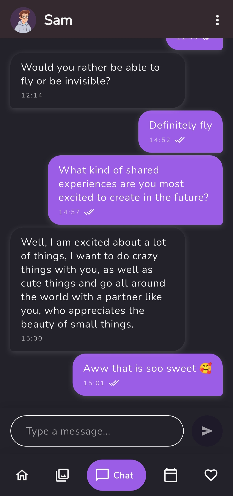
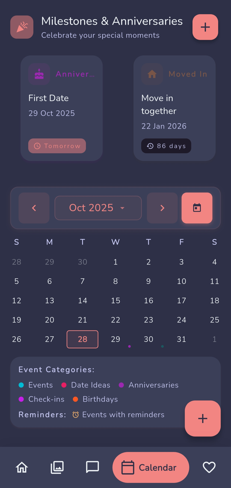
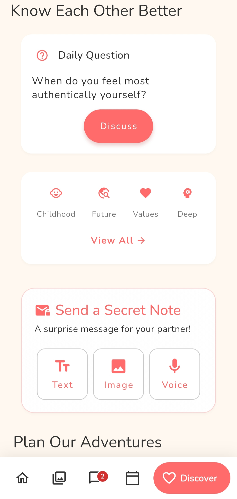
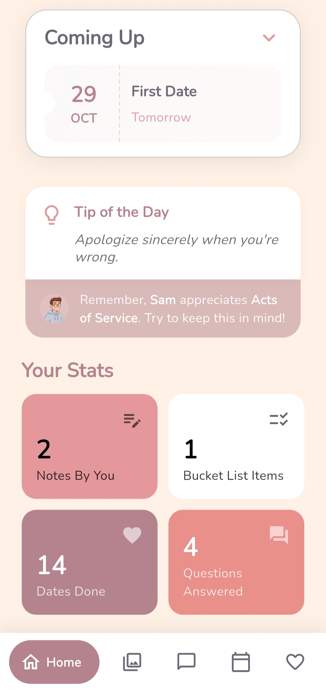
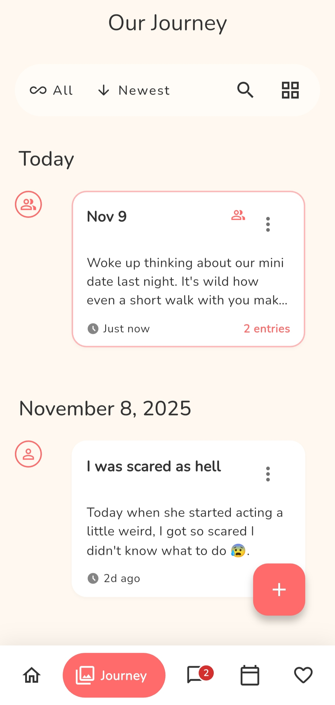

# Feelings — A Relationship Management App  
A full-scale, cross-platform Flutter application built to help couples communicate better, track memories, plan events, and strengthen their relationship through meaningful interactions.

> 🟢 **Published on Google Play** (Production Release: Nov 19, 2025)

Web app Link -> [Feelings App](https://feelings-d43f8.web.app/)

Play Store Link -> [Feelings App](https://play.google.com/store/apps/details?id=com.feelings.app)

Test Credentials:
- email : johndoe1903@gmail.com
- password : john@1234A
---

## 🚀 Features

### 🏠 Home Dashboard
- User & partner mood overview  
- **Relationship Health Meter** based on engagement points  
- Upcoming events preview  
- Quick stats: total notes, questions answered, dates completed, events, etc.

---

## 📔 Journals
- **Memories Gallery:** Image-based timeline with captions  
- **Shared Journal:** Collaborative journal for both users  
- **Personal Journal:** Private notes visible only to the user

---

## 💬 Real-Time Chat
- Text messages  
- Image sharing  
- Audio messages  
- Clean and responsive chat UI

---

## 📅 Calendar & Milestones
- Add milestones (first date, anniversary, birthdays, etc.)  
- Event calendar with indicator dots  
- Filterable list of upcoming events

---

## 🔍 Discover Section
- **Question of the Day** to spark conversations  
- **Secret Notes:** Send hidden text/image/audio notes that appear randomly  
- **Bucket List:** Create and complete shared goals  
- **Date Night Planner:** Plan, manage, and complete dates  
- **Check-ins:** Track relationship health with guided questions  
- Helpful relationship tips

---

## 🛠️ Tech Stack

### **Frontend**
- Flutter  
- Provider (state management)  
- Custom UI with animations & responsive layouts  

### **Backend**
- Firebase Authentication  
- Cloud Firestore (real-time + offline support)  
- Firebase Cloud Messaging  
- Cloud Functions  
- Cloudinary (media hosting)

---

## ⚙️ Architecture
- Clean, modular structure with feature-based folders  
- Reusable widgets & services  
- Optimized Provider structure → **40% fewer rebuilds**  
- Real-time listeners with debounce & caching  
- State-safe navigation across 30+ screens  
- Custom theme choices for user

---

## 📦 Key Achievements
- Production-ready Flutter app published to Play Store  
- Real-time sync latency under **150ms** during testing  
- Relationship scoring model that improved user engagement by **~35%**  
- Robust handling of images/audio using Cloudinary + Firebase  
- Designed a complete event/journal/chat ecosystem  

---

## 📱 Screenshots

  
  
  
  
  
  

---

## 🧪 Testing & Deployment
- 14-day closed testing completed  
- App reviewed & published on Play Store  
- Error monitoring and analytics enabled  

---

## 🧑‍💻 Author  
**Abhishek Kumar**  
Flutter Developer | Full Stack | Firebase | Product Builder  

