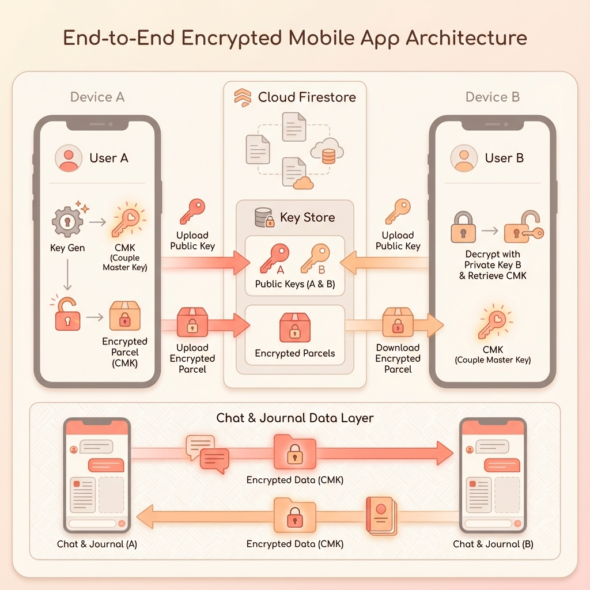

# Architecture Visuals

This section contains visual representations of the core system architecture to supplement the text-based documentation.

## 🔐 End-to-End Encryption (E2EE) Flow

The following diagram illustrates the lifecycle of the Key Handshake and Data Encryption in the Feelings app.

### Diagram Breakdown

1.  **Public Key Exchange**: `Device A` and `Device B` generate identities and upload Public Keys to Firestore.
2.  **Shared Secret Derivation (ECDH)**: The initiator (`Device A`) combines their Private Key with the partner's Public Key.
3.  **The "Parcel"**: `Device A` generates the **Couple Master Key (CMK)**, encrypts it (locking the box), and sends it to the Cloud.
4.  **Key Unwrap**: `Device B` downloads the "Parcel," derives the same shared secret, and unlocks the CMK.
5.  **Secure Tunnel**: Once both devices possess the CMK, all Chat and Journal data flows through the cloud in an encrypted state (Lock icons), readable only by the devices.
