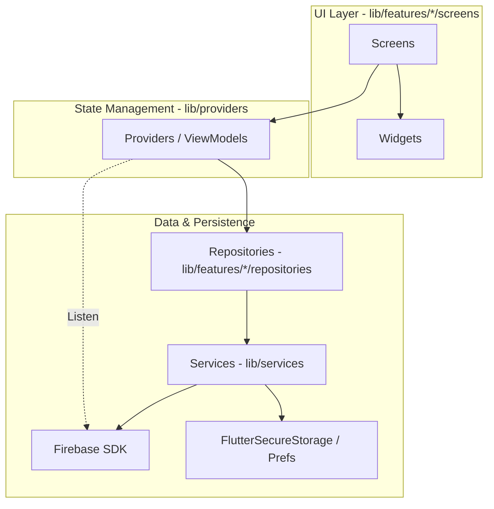

# Feelings - Full Project Documentation

This document contains the complete technical documentation for the "Feelings" Flutter project, consolidated into a single file for easy reference.

## 📑 Table of Contents

1. [Global Overview](#global-overview-feelings)
2. [Core Components](#core-components-deep-dive)
3. [Detailed Services](#detailed-services-documentation)
4. [State Management](#state-management-technical-details)
5. [Feature: Authentication](#feature-authentication--user-management)
6. [Feature: User Onboarding](#feature-user-onboarding)
7. [Feature: Couple Connection](#feature-couple-connection)
8. [Feature: Home Dashboard](#feature-home-dashboard--navigation)
9. [Feature: Real-Time Chat](#feature-real-time-chat)
10. [Feature: Journals](#feature-personal--shared-journals)
11. [Feature: Calendar & Milestones](#feature-couple-calendar--milestones)
12. [Feature: Relationship Check-ins](#feature-relationship-check-ins)
13. [Feature: Secret Notes](#feature-secret-notes-ephemeral-surprises)
14. [Feature: Bucket List](#feature-bucket-list)
15. [Feature: Discover Hub](#feature-discover-hub)
16. [Feature: Date Nights](#feature-date-nights)
17. [Feature: Relationship Tips](#feature-relationship-tips)
18. [Feature: Mood Tracker](#feature-mood-tracker)
19. [Feature: Relationship Questions](#feature-relationship-questions)
20. [Feature: RHM Meter](#feature-relationship-health-meter-rhm)
21. [Feature: Media Management](#feature-media-management)
22. [Feature: Encryption Flow (UI)](#feature-encryption-flow-ui)
23. [Feature: App Status](#feature-app-configuration--status)
24. [Architecture Visuals](#architecture-visuals)

---

# Global Overview: Feelings

"Feelings" is a high-performance, secure relationship management application. It follows a principled approach to data privacy via a custom End-to-End Encryption (E2EE) layer and a responsive state management architecture.

## 🏗️ High-Level Architecture

The app uses a layered MVVM-inspired architecture, optimized for real-time Firebase sync and offline-first capabilities.



- **Feature-Based Modularization**: Code is organized by feature (chat, journal, etc.) in `lib/features/`, containing its own UI, models, and repositories.
- **Provider Pattern**: Centralizes state and orchestrates data flow between UI and Repositories.
- **Singleton Services**: App-wide infrastructure (Encryption, Notifications) exists as singletons for consistent state.

## 🚀 App Lifecycle & Initialization

The `main()` function in `lib/main.dart` is designed for "Aggressive UI Unblocking."

### 1. Boot Sequence
The app parallelizes initialization to reach the first frame faster:

| Action | Execution | Why? |
| :--- | :--- | :--- |
| `dotenv.load()` | Await | Required for subsequent configs. |
| `Firebase.initializeApp()` | Await | Core dependency. |
| **Parallel Inits** | **Future.wait** | `Crashlytics`, `Encryption`, `Notifications`, `Review`. |
| `themeProvider.loadTheme()` | Background | Starts with default, updates when ready. |
| `runApp()` | Immediate | Triggered as soon as Firebase is ready. |

### 2. The Auth State Machine
Navigation is handled by a reactive wrapper system:

- **`AuthWrapper`**: A `StreamBuilder` listening to `FirebaseAuth.instance.authStateChanges()`. It manages session cleanup and triggers `_performCleanupAsync()` on logout to wipe sensitive keys from memory.
- **`UserDataLoader`**: Once authenticated, this component:
    1.  Fetches user metadata (`UserProvider`).
    2.  Fetches couple/partner connection (`CoupleProvider`).
    3.  Attempts to load the `EncryptionService` Master Key.
    4.  Starts unread note listeners.
- **`BottomNavBar`**: The final destination, loaded only after primary data is ready.

## 🔒 Security Philosophy

- **Privacy by Default**: Sensitive fields (chat content, journal entries) are NEVER stored in plaintext on Firebase.
- **Client-Side Encryption**: Data is encrypted before leaving the device and decrypted only in the UI layer.
- **Identity Awareness**: Encryption is tied to a "Device Identity" (`X25519` key pair), not just the user account, preventing unauthorized access even if Firestore rules are bypassed.

---

# Core Components: Deep Dive

## 🎨 Advanced Theming (`lib/theme/`)

The Feelings app uses a sophisticated theme engine that goes beyond standard `ThemeData`.

### `MoodTheme` (Theme Extension)
We use `ThemeExtension<MoodTheme>` to inject custom, mood-specific color palettes into the standard `Theme`. This allows UI components to access mood colors safely:
```dart
final moodTheme = Theme.of(context).extension<MoodTheme>()!;
Color joyColor = moodTheme.joy;
```
- **Lerp Support**: Implements `lerp` for smooth transitions between different theme categories (e.g., switching from "Oceanic" to "Sunset").
- **12 Categories**: Defines semantic colors for 12 standard moods (Joy, Playful, Love, Focus, Sadness, etc.).

### Theme Factory Logic
The `AppTheme` class uses a private factory `_createTheme` to generate consistent looks for 10+ available themes. It configures:
- **Google Fonts**: Inter/Roboto integration.
- **Component Themes**: Standardized `ElevatedButtonThemeData`, `CardThemeData`, and `InputDecorationTheme`.
- **Brightness Awareness**: Distinct templates for Light and Dark modes.

---

## 🛠️ Global Utilities & Widgets

### `CrashlyticsHelper` (`lib/utils/crashlytics_helper.dart`)
A robust wrapper around Firebase Crashlytics:
- **Fatal Error Mapping**: Correctly handles Flutter fatal errors and platform-level exceptions.
- **Custom Context**: Automatically attaches `userId` and `coupleId` to every crash report.
- **breadcrumb Logging**: Provides a `log()` method to trace user actions before a crash.

### `RhmPointsAnimationOverlay` (`lib/widgets/`)
An app-wide overlay logic that listens to `RhmRepository` events.
- **Visual Feedback**: Triggers floating point animations when users perform positive relationship actions (sending a chat, completing a date).
- **Concurrency**: Manages a queue of animations to ensure they don't overlap or clutter the UI.

### `Globals` (`lib/utils/globals.dart`)
Contains the `rootScaffoldMessengerKey`. This is critical because it allows any service or provider to show a `SnackBar` without needing a `BuildContext` (e.g., showing an error from a background repository task).

---

# Detailed Services Documentation

## 🔐 The Encryption Handshake (`EncryptionService`)

The app's security is built on a "Trust-on-First-Auth" model.

### 1. Device Identity Generation
On first launch, the service generates an `X25519` key pair. The **Private Key** is stored in `FlutterSecureStorage` and NEVER leaves the device.

### 2. The Handshake Flow (ECDH)
When two users connect:
1.  **Exchange**: User A and User B upload their **Public Keys** to Firestore (`users/{id}/publicKey`).
2.  **Shared Secret**: User A downloads User B's Public Key. Using their own Private Key, they derive a **Shared Secret** via ECDH.
3.  **Key Wrapping**: User A generates a random **Couple Master Key (CMK)** and encrypts it with the Shared Secret (using HKDF for key derivation and Chacha20 for encryption).
4.  **The "Parcel"**: User A uploads this encrypted CMK (the "parcel") to Firestore.
5.  **Receipt**: User B's device detects the parcel, derives the same Shared Secret using User B's Private Key + User A's Public Key, and decrypts the CMK.

### 3. Data Encryption Specs
- **Symmetric Cipher**: Chacha20-Poly1305 (AEAD).
- **KDF**: HKDF with HMAC-SHA256 for session keys; Argon2id for passphrase-based backups.
- **Key Storage**: `FlutterSecureStorage` (Keychain/Keystore) ensures keys are encrypted at rest on the hardware level.

---

## 🔔 Notification Architecture (`NotificationService`)

The notification system is deeply integrated with the app's business logic.

### FCM Lifecycle
- **Token Sync**: Tokens are refreshed on every login and stored in `users/{id}/fcmTokens` (a list to support multiple devices).
- **Notification Groups**: On Android, we dynamically create `NotificationChannel`s for partners, allowing users to customize alert sounds specifically for their partner.
- **Silent Data Messages**: Some notifications are "Data Only," used to trigger background syncs or update local unread counts without alerting the user.

### Click Handling
The service exposes a static `onNotificationClick` callback used in `main.dart` to navigate via the `navigatorKey`. This ensures that even if the app is in the background, clicking a chat notification takes the user directly to the correct screen.

---

## 🧪 Service Integrity & Error Handling

Each service implements a "Safe-Fail" pattern:
- **Firebase Initialization**: Wrapped in try-catch to allow the app to boot even if configuration is missing (e.g., during local development without `.env`).
- **Secure Storage**: Includes a `hardReset()` option for developer use or account deletion, ensuring no cryptographic residue is left behind.
- **Permission Management**: Bridges with `permission_handler` to gracefully handle denied notification or storage permissions.

---

# State Management: Technical Details

## 💾 Caching Strategy: Stale-While-Revalidate

The primary providers (`UserProvider`, `CoupleProvider`) implement a robust caching layer to ensure "Instant App" feel regardless of network speed.

### Flow for `fetchUserData()`:
1.  **Stage 1 (Cache)**: Queries Firestore with `Source.cache`. If data exists, it updates `_userData` and `notifyListeners()` immediately. UI renders instantly.
2.  **Stage 2 (Server)**: Simultaneously triggers a query with `Source.server`.
3.  **Merge**: When the server response returns, it checks for changes. If the data is different, it updates the state and notifies listeners again.
4.  **Secondary Data**: Triggers background tasks like `_cacheProfileImage` only after the primary data is established.

### User-Specific Caching
Image caching (`_cacheProfileImage`) is scoped to `userId`. This prevents "Partner Overlap" when logging between different accounts on the same device. Paths are stored in `SharedPreferences` and physical files in `getApplicationDocumentsDirectory()`.

---

## 💬 Chat Provider: The Messaging Engine

Managing real-time chat with encryption and optimistic UI is handled through several key mechanisms:

### 1. Optimistic Message Merging
When sending a message, the provider creates a `MessageModel` with `isSending: true` and adds it to the local list.
- **Server Sync**: Once Firestore confirms the write, the temporary message is replaced by the official server version via `_mergeWithOptimisticMessages`.
- **ID Stability**: We use a `tempId` generated on the client to track messages during this round-trip.

### 2. Intelligent Decryption
- **Lazy Decryption**: Messages are stored in the `ChatProvider` list as received (encrypted).
- **Automatic Migration**: The `ChatProvider` implements a "Check-on-View" migration. If it encounters a message with `encryptionVersion: null`, it automatically encrypts it with the CMK and updates Firestore.
- **Failure Recovery**: If a message fails decryption (e.g., key sync delay), the UI shows a "Waiting for secure connection" placeholder.

### 3. Engagement Tracking (RHM)
The `ChatProvider` doesn't just manage messages; it manages relationship health.
- **Action Logging**: Every sent message triggers an asynchronous call to `RhmRepository`.
- **Throttling**: To prevent spam, point awards are throttled via internal timers, ensuring points are awarded for meaningful interaction.

---

## 🤝 CoupleProvider: The Connection Hub

The `CoupleProvider` acts as the orchestrator for the partner relationship.

### Key Logic: `auto-handshake`
- **Listener Activity**: On startup, it checks if it has the CMK. If not, it starts `listenForIncomingKey` to wait for a "Key Parcel" from the partner.
- **Public Key Refresh**: It automatically ensures the device's current Public Key is always synced to Firestore, fixing issues where a fresh app install would lead to keys being lost.
- **Soft vs Hard Disconnect**:
    - **Soft**: Removes the connection but preserves the couple document (for 14-day history).
    - **Hard**: Deletes the entire couple document and subcollections (triggered when both users disconnect).

---

# Feature: Authentication & User Management

The `auth` feature handles user registration, boarding, profile management, and session security.

## 📂 Directory Structure

```text
lib/features/auth/
├── models/         # UserModel definition
├── screens/        # Login, Register, Profile, Change Password screenshots
├── services/       # AuthService (logic) and UserRepository (data)
└── widgets/        # Specialized auth UI components (Form fields, buttons)
```

## 👤 User Model (`UserModel`)

The `UserModel` represents the profile of a user in the system.

- **Core Fields**: `id`, `email`, `name`, `profileImageUrl`.
- **Relationship Fields**: `coupleId` (links to a couple document), `loveLanguage`, `gender`.
- **Status Fields**: `mood`, `moodLastUpdated`, `encryptionStatus` ('pending', 'enabled', 'disabled').
- **Settings**: `notificationsEnabled`, `locationSharingEnabled`.

## ⚙️ Logic Layer (`AuthService`)

A high-level service that interacts directly with `FirebaseAuth` and coordinate with `UserRepository`.

### Core Flow: Register (`register`)
1. Creates a user in `FirebaseAuth` with email/password.
2. If successful, creates a corresponding user document in Firestore via `UserRepository.saveUserData`.
3. Stores the `userId` locally in `SharedPreferences`.

### Google Sign-In (`signInWithGoogle`)
1. Orchestrates the OAuth flow using `google_sign_in`.
2. Exchanges the Google token for a Firebase credential.
3. Automatically completes registration if the user is new.

### Session Cleanup (`logout`)
1. Triggers `FirebaseAuth.instance.signOut()`.
2. Clears local `SharedPreferences`.
3. Calls `EncryptionService.instance.clearSessionKeys()` to ensure sensitive crypto keys are wiped from memory.

---

## 🏗️ Data Layer (`UserRepository`)

Handles all Firestore interactions for user profiles and tokens.

### Key Methods
- **`getUserData(userId, {source})`**: Fetches user profile. Supports `Source.cache` for instant UI and `Source.server` for fresh data.
- **`updateUserMood(userId, mood)`**: Optimistically updates the user's mood in Firestore.
- **`sendPushNotification(...)`**: A helper that sends a request to a server-side endpoint (usually via a Cloud Function bridge) to trigger FCM alerts to the partner.
- **`deleteUserAccount()`**: Securely deletes all user data (Chat, Journals, Profile) by invoking a Cloud Function. This ensures "Cascading Deletion" for privacy compliance.

---

# Feature: User Onboarding

The `onboarding` feature is the "first mile" experience for new users, guiding them through identity setup, email verification, and the critical step of connecting with a partner.

## 📂 Directory Structure

```text
lib/features/onboarding/
└── onboarding_screen.dart  # The 1400+ line multi-step orchestrator
```

## 🛠️ The Onboarding Flow

The onboarding process is a multi-page experience managed by a `PageController`:

1.  **Welcome**: Introduction to the "Feelings" concept.
2.  **Email Verification**: Forces users to verify their email before proceeding. Uses a real-time polling timer (`Timer.periodic`) to check the Firebase Auth state.
3.  **Basic Profile**: 
    - **Name & Photo**: Integrated with `CloudinaryHelper` for immediate profil image hosting.
    - **Identity**: Selection of Gender and Love Language.
4.  **Partner Connection**:
    - **Generate Code**: Generates a random invite code for the user to share.
    - **Accept Code**: Allows the user to enter a partner's code or scan a QR code.
    - **Real-time Confirmation**: Uses `CoupleProvider` to verify the connection.
5.  **Relational Context**: Optional setup for shared location (Distance-based tips).

## ⚙️ Logic & Transitions

- **Success Transition**: Once the final `_completeOnboarding()` method is called, the user document is marked with `onboardingCompleted: true` and the app navigates to the Home screen (/bottom_nav).
- **Graceful Failures**: Includes extensive error handling for network timeouts, verification delays, and invalid connection codes.

---

# Feature: Couple Connection

The `connectCouple` feature manages the unique lifecycle of a relationship inside the app, from the initial invitation to account separation.

## 📂 Directory Structure

```text
lib/features/connectCouple/
├── repository/     # CoupleRepository (Lifecycle logic)
└── screens/        # Connection screens (Invite/Accept)
```

## 💍 Relationship Lifecycle

The `CoupleRepository` handles four main states:

1. **Invitation**: One user generates a connection code (their `userId`).
2. **Connection**: The partner enters the code. `connectUsers` creates a shared document in the `couples` collection.
3. **Reactivation**: If a couple was previously disconnected but rejoins, the system can "reactivate" the old document to preserve history.
4. **Separation**: 
   - **Soft Disconnect**: Marks the relationship as inactive but preserves data.
   - **Hard Delete**: Calls a cascading deletion process to remove all shared bucket lists, journals, and chat history.

## 🔗 The Glue System

The `CoupleRepository` acts as the primary coordinator for the **Key Handshake**:
- It provides the transport layer for `EncryptionService` to exchange public keys and encrypted master keys.
- It manages shared relational metadata like "Anniversary Date" and "Connection Status."

---

# Feature: Home Dashboard & Navigation

The `home` feature acts as the central hub of the Feelings app, providing a high-level overview of the relationship and quick access to all major features.

## 📂 Directory Structure

```text
lib/features/home/
├── screens/        # HomeScreen, BottomNavBar, RhmDetailScreen
├── view_models/    # HomeScreenViewModel (Logic)
└── widgets/        # Specialized dashboard components (RHM Meter, Events, Stats)
```

## 🧭 Navigation: `BottomNavBar`

The `BottomNavBar` uses the `google_nav_bar` package for a premium, animated feel.

- **Centralized Routing**: Manages transitions between `HomeScreen`, `JournalScreen`, `ChatScreen`, and `CalendarScreen`.
- **Badges**: Displays real-time unread message counts on the Chat icon by listening to the `ChatProvider`.
- **Security Guard**: It is responsible for triggering the `EncryptionSetupDialog` if it detects that the user has encryption enabled but the local master key is missing.

## 🏠 Dashboard: `HomeScreen`

The dashboard is designed to be informative and "at-a-glance."

### Data Aggregation (`HomeScreenViewModel`)
The `HomeScreenViewModel` is a feature-specific provider that aggregates data from multiple sources:
- **Relationship Health**: Fetches current points from `RhmRepository`.
- **Engagement Stats**: Calculates counts for shared notes, photos, and messages.
- **Partner Insight**: Displays the partner's current mood and last updated time.
- **Syncing**: Coordinates with `UserProvider` and `CoupleProvider` to ensured data is loaded before rendering.

---

# Feature: Real-Time Chat

The `chat` feature is the core communication engine of the Feelings app, supporting real-time messaging, end-to-end encryption, and rich media sharing.

## 📂 Directory Structure

```text
lib/features/chat/
├── models/         # MessageModel (Rich data structure)
├── repositories/   # ChatRepository (Sync, Typing, Persistence)
├── screens/        # ChatScreen (The main conversation UI)
└── widgets/        # Specialized bubbles (Text, Voice, Image) and Input
```

## 🏗️ Data Architecture

### `MessageModel`
A versatile model that handles:
- **Types**: `text`, `image`, `voice`.
- **States**: `sending`, `sent`, `seen`.
- **E2EE**: Stores `ciphertext`, `mac`, `nonce` for captions, and specialized "OTK" (One-Time Key) fields for audio files.
- **Replies**: Contextual metadata for nested replies, including image thumbnails.

### `ChatRepository`
Manages the Firestore "Chat Room" located at `chats/{chatId}/messages`.
- **`listenToMessages`**: Provides a real-time stream of the latest messages, ordered by timestamp.
- **`updateTypingStatus`**: Manages a transient `typing` field in the chat metadata to show real-time "Partner is typing..." indicators.
- **`sendMessage`**: Orchestrates the multi-step process of sending a message (Local sync -> Encryption -> Media Upload -> Firestore Write).

---

## 🔒 Encryption in Chat

Chat uses the **Couple Master Key (CMK)** to secure all standard communications.

- **Text**: Encrypted using Chacha20-Poly1305. The CMK is used with a unique nonce per message.
- **Media (Images/Voice)**: 
    1. A random **One-Time Key (OTK)** is generated for the file.
    2. The file is encrypted using the OTK.
    3. The OTK is encrypted using the CMK and stored in the message document (`audioGlobalOtk`).
    4. Only a partner with the CMK can decrypt the OTK, and thus the file.

---

## 🎙️ Rich Media Support

### Voice Messages
- **Recording**: Uses `path_provider` for temporary storage.
- **Spectrum Visualization**: Real-time waveform rendering during playback.
- **Decryption-on-the-fly**: Voice files are decrypted as they are streamed/played to ensure they never sit unencrypted on the device storage for long.

### Image Sharing
- **Cloudinary Integration**: Images are optimized and hosted via Cloudinary.
- **Thumbnails**: In-thread thumbnails are provided for quick browsing.

---

# Feature: Personal & Shared Journals

The `journal` feature allows users to document their personal thoughts and collaborate on shared memories with their partner.

## 📂 Directory Structure

```text
lib/features/journal/
├── repository/     # JournalRepository (Personal & Shared logic)
├── screens/        # JournalScreen (History), JournalEditingScreen
└── widgets/        # Segment editors, entry tiles, sort buttons
```

## 📝 Entry Types

### 1. Personal Journal
Stored under `users/{userId}/personalJournals/`. These are private to the individual user and are not shared with the partner.
- **Privacy**: Encrypted using the user's local encryption keys (if enabled).

### 2. Shared Journal
Stored under `couples/{coupleId}/sharedJournals/`. These are collaborative entries that both partners can view and edit.
- **Segmented Writing**: Shared journals are composed of "Segments." Each segment tracks its author and timestamp, allowing for a back-and-forth collaborative writing experience.
- **Encryption**: Strictly uses the **Couple Master Key (CMK)** to ensure only the two partners can read the shared entries.

---

## 🏗️ Data Structure: Segments

Unlike standard text blocks, a journal entry in Feelings is a list of segments:

```json
{
  "title": "Encrypted Title",
  "segments": [
    {
      "authorId": "user1",
      "content": "Encrypted text from User 1",
      "timestamp": "..."
    },
    {
      "authorId": "user2",
      "content": "Encrypted response from User 2",
      "timestamp": "..."
    }
  ]
}
```

## ⚙️ Logic & State (`JournalProvider`)

The global `JournalProvider` manages the lifecycle of these entries:
- **Streaming**: Provides `Stream<List<JournalEntry>>` for both personal and shared collections.
- **Optimistic Updates**: When a user adds a segment, the UI updates immediately while the encrypted write is sent to Firestore.
- **Migration**: Automatically handles "Legacy to E2EE" migration. If an old plaintext journal is opened, the provider encrypts it using the CMK and saves it back to the server.

---

# Feature: Couple Calendar & Milestones

The `calendar` feature helps couples organize their shared life, plan quality time, and remember significant milestones.

## 📂 Directory Structure

```text
lib/features/calendar/
├── models/         # CalendarEvent and Milestone definitions
├── repository/     # CalendarRepository (Firestore logic)
├── screens/        # CalendarScreen, AddEventWizard, EventDetails
└── widgets/        # Grid view, Header, Event cards
```

## 📅 Shared Calendar Events

Events are stored collaboratively in `couples/{coupleId}/events/`.

- **Event Metadata**: Includes `title`, `description`, `startDate`, `endDate`, `location`, and `category`.
- **Personal vs. Shared**: While most events are shared, the system supports an `isPersonal` flag for events only relevant to one partner.
- **Reminders**: Users can set `reminderTime` presets (e.g., "1 hour before"). The `CalendarProvider` uses the `NotificationService` to schedule local notifications on the hardware.

## 🎉 Milestones

Milestones are long-term markers of the relationship (e.g., "First Date," "Moving In").
- **Persistence**: Stored in `couples/{coupleId}/milestones/`.
- **Specialized UI**: Milestones are displayed with distinct styling to differentiate them from routine events.
- **Coupling**: Events can be linked to milestones via `milestoneId`.

---

# Feature: Relationship Check-ins

The `check_in` feature provides a structured space for partners to reflect on their relationship, share insights, and track emotional trends over time.

## 📂 Directory Structure

```text
lib/features/check_in/
├── models/         # CheckInModel, CheckInQuestion
├── repository/     # CheckInRepository (Generation & Sharing logic)
├── screens/        # Welcome, Question flow, Summary, History
└── widgets/        # Question types (Slider, Multi-choice), Insight cards
```

## 📋 The Check-in Flow

A check-in is a private reflection session with several distinct phases:

1. **Question Selection**: The `CheckInRepository` generates a set of questions. These can be standard "Relationship Health" questions or dynamic "Trend-Based" questions if the system detects recurring themes in the user's mood.
2. **Interactive Session**: The user answers questions using various input types: Slider, Text Input, Yes/No & Multiple Choice.
3. **Insight Generation**: Upon completion, the system helps the user identify key "Insights" from their answers.
4. **Controlled Sharing**: Users can choose to keep the session entirely private, share only specific insights, or share the full results.

---

# Feature: Secret Notes (Ephemeral Surprises)

The `secret_note` feature is designed to add a sense of playfulness and surprise to the relationship. It allows partners to leave "hidden" messages for each other that appear in unexpected places within the app.

## 📂 Directory Structure

```text
lib/features/secret_note/
├── repositories/   # SecretNoteRepository (CRUD & Logic)
├── screens/        # SecretNotesScreen (Creation & History)
└── widgets/        # SecretNoteIcon (The surprise icon), View Dialog
```

## 🕵️ How It Works: The Treasure Hunt

Secret notes are not shown in a standard list. Instead, the `SecretNoteProvider` dynamically places them in the UI:

1. **Unread Listening**: The app listens for any unread notes in `couples/{coupleId}/secret_notes/`.
2. **Random Assignment**: When a note is found, the `SecretNoteProvider` randomly assigns it to one of 7 locations (e.g., `moodBox`, `rhmMeter`, `chatAppBar`).
3. **The Discovery**: The user sees a small "Fluttering Envelope" icon in one of these locations.
4. **True Ephemerality**: Once the user opens the note and reads it, the document is **permanently deleted** from Firestore.

---

# Feature: Bucket List

The `bucket_list` feature allows couples to create and track a shared list of dreams, adventures, and collective goals.

## 📂 Directory Structure

```text
lib/features/bucket_list/
├── repository/     # BucketListRepository (Firestore CRUD)
├── screens/        # BucketListScreen
└── (logic)         # Managed by BucketListProvider (global)
```

## 📝 Collaborative Goals

Bucket list items are stored in `couples/{coupleId}/bucketList`.

- **Ownership**: Each item tracks `createdBy`, allowing users to filter by "Mine," "Partner's," or "Both."
- **Date Idea Integration**: Items can be created directly from the "Discover" section's date ideas.
- **Completion & Sync**: When an item is marked "Done," it can automatically trigger the creation of a `DoneDate` (in the `DoneDatesProvider`), serving as a historical record of the achievement.

---

# Feature: Discover Hub

The `discover` feature is the exploratory heart of the "Feelings" app, acting as a gateway to new activities, relationship insights, and shared growth.

## 📂 Directory Structure

```text
lib/features/discover/
├── screens/        # DiscoverScreen (Combined view)
└── widgets/        # Specialized cards and sections
```

## 🎭 Date Night Engine (`DateIdeaProvider`)

The "Date Night" card is the primary interaction point in Discover:
- **Filtered Generation**: Users can generate date ideas based on **Vibe**, **Budget**, **Time**, and **Location**.
- **Suggest to Partner**: A user can "Suggest" a specific idea. This triggers a push notification to the partner and opens a real-time sync session.

---

# Feature: Date Nights

The `date_night` feature helps couples break out of routines by generating creative date ideas and facilitating real-time planning via suggestions.

## 📂 Directory Structure

```text
lib/features/date_night/
├── models/         # DateIdea model
├── repository/     # DoneDatesRepository (Historical tracking)
├── services/       # DateIdeaService (The generation engine)
└── screens/        # Generator, Suggested Idea, Done Dates History
```

## 🎲 The Generation Engine (`DateIdeaService`)

The core of this feature is a "Smart Fallback" generation strategy:
1. **Perfect Match**: Attempts to find an idea matching all user filters.
2. **Loosened Constraints**: If no match is found, it drops Budget/Time constraints.
3. **Location Only**: Drops all filters except Location.
4. **Any Idea**: Returns a random date idea as a last resort.

---

# Feature: Relationship Tips

The `tips` feature provides hyper-personalized, context-aware advice to help couples navigate their daily emotional landscape and strengthen their connection.

## 📂 Directory Structure

```text
lib/features/tips/
├── data/           # static_tips.dart
├── models/         # TipModel, DailyTipModel
├── repository/     # TipsRepository, DailyTipRepository
└── services/       # TipService (The dynamic logic engine)
```

---

# Feature: Mood Tracker

The `mood` feature allows partners to share their current emotional state in real-time.

## 🎭 The MoodBox Widget

The Home screen features a prominent `MoodBox` that serves as the visual anchor:
- **Dual Display**: Shows both the user's and the partner's current mood side-by-side.
- **Fluid Visuals**: Uses custom `FluidWave` painters to create an "emotional tide" effect.

## ⚙️ State Management (`UserProvider`)

Mood logic is integrated directly into the `UserProvider` for maximum speed:
- **Optimistic Updates**: UI updates instantly (`updateUserMood`).
- **Real-time Sync**: A listener (`listenToPartnerMood`) ensures the partner's mood updates instantly.

---

# Feature: Relationship Questions

The `questions` feature provides a vast library of conversation starters.

## 🗓️ Question Categories

- Foundation, Relationship Reflections, Aspirations, Emotional Landscape.
- Sub-Categories: Rooted Memories, Shared Milestones, Guiding Principles, Inner Depths, etc.

## 📅 Daily Question of the Day (QOTD)

The `QuestionProvider` implements a specialized QOTD system:
- **Daily Rotation**: A new question is randomly selected every 24 hours.
- **Persistence**: Both partners see and discuss the same question throughout the day.
- **Tracking**: Once answered, the question is not repeated.

---

# Feature: Relationship Health Meter (RHM)

The RHM quantifies the active effort both partners are putting into the relationship over a rolling 7-day window.

## 📐 The Scoring Algorithm

- **Rolling Window**: Only points earned in the **last 7 days** contribute to the score.
- **The Target**: A score of **75 points** in a week = 100% RHM.
- **Natural Decay**: Points automatically "expire" from the calculation after 7 days.

## 💎 Point Economy

| Action Type | Points | Frequency Limit |
| :--- | :--- | :--- |
| **Complete Date Idea** | +10 | None |
| **Complete Bucket List Item** | +5 | None |
| **Answer Daily Question** | +1 | 1 per Day / User |
| **Add Bucket List Item** | +1 | 1 per 7 Days / Couple |
| **Send Secret Note** | +1 | 1 per 7 Days / Couple |

---

# Feature: Media Management

The `media` system handles public accessibility for profiles and strict privacy for shared memories.

## ☁️ Public Storage (`CloudinaryHelper`)

Used for profile pictures. Images are automatically transformed and resized by Cloudinary for performance.

## 🔒 Private Storage (`GoogleDriveHelper`)

Used for sensitive, End-to-End Encrypted (E2EE) media:
- **User-Owned**: Media is stored in the user's personal Google Drive.
- **E2EE Integration**: Files are encrypted locally before upload and decrypted on-the-fly after download.

---

# Feature: Encryption Flow (UI)

The `encryption` feature folder manages the user experience of securing the relationship.

## 🤝 Key Handshake

1. **Identity Generation**: Each device generates an `X25519` key pair.
2. **Public Key Exchange**: Partners exchange public keys via Firestore.
3. **Master Key Creation**: The "initiator" generates the Couple Master Key (CMK).
4. **CMK Transfer**: The CMK is encrypted with the partner's public key and shared securely.

---

# Feature: App Configuration & Status

The `app_config` feature provides a global control plane for the application.

## 🌐 Global Status Monitoring (`AppConfigService`)

- **Maintenance Mode**: Can prevent users from proceeding to the dashboard.
- **Alert System**: Can push a non-blocking `message` (alert banner) to all users.
- **Reactive UI**: Any widget in the app can react instantly to environment changes.
