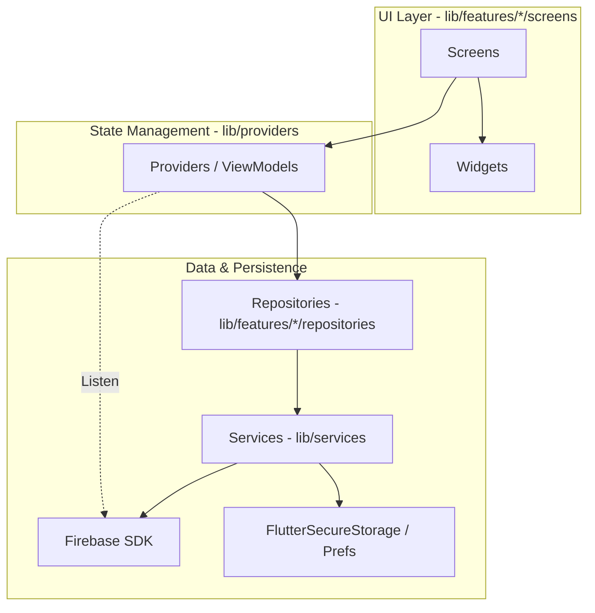

# Project Overview: Feelings

"Feelings" is a high-performance, secure relationship management application. It follows a principled approach to data privacy via a custom End-to-End Encryption (E2EE) layer and a responsive state management architecture.

## 🏗️ High-Level Architecture

The app uses a layered MVVM-inspired architecture, optimized for real-time Firebase sync and offline-first capabilities.

- **Feature-Based Modularization**: Code is organized by feature (chat, journal, etc.) in `lib/features/`, containing its own UI, models, and repositories.
- **Provider Pattern**: Centralizes state and orchestrates data flow between UI and Repositories.
- **Singleton Services**: App-wide infrastructure (Encryption, Notifications) exists as singletons for consistent state.

## 🚀 App Lifecycle & Initialization

The `main()` function in `lib/main.dart` is designed for "Aggressive UI Unblocking."

### 1. Boot Sequence
The app parallelizes initialization to reach the first frame faster:

| Action | Execution | Why? |
| :--- | :--- | :--- |
| `dotenv.load()` | Await | Required for subsequent configs. |
| `Firebase.initializeApp()` | Await | Core dependency. |
| **Parallel Inits** | **Future.wait** | `Crashlytics`, `Encryption`, `Notifications`, `Review`. |
| `themeProvider.loadTheme()` | Background | Starts with default, updates when ready. |
| `runApp()` | Immediate | Triggered as soon as Firebase is ready. |

### 2. The Auth State Machine
Navigation is handled by a reactive wrapper system:

- **`AuthWrapper`**: A `StreamBuilder` listening to `FirebaseAuth.instance.authStateChanges()`. It manages session cleanup and triggers `_performCleanupAsync()` on logout to wipe sensitive keys from memory.
- **`UserDataLoader`**: Once authenticated, this component:
    1.  Fetches user metadata (`UserProvider`).
    2.  Fetches couple/partner connection (`CoupleProvider`).
    3.  Attempts to load the `EncryptionService` Master Key.
    4.  Starts unread note listeners.
- **`BottomNavBar`**: The final destination, loaded only after primary data is ready.

## 🔒 Security Philosophy

- **Privacy by Default**: Sensitive fields (chat content, journal entries) are NEVER stored in plaintext on Firebase.
- **Client-Side Encryption**: Data is encrypted before leaving the device and decrypted only in the UI layer.
- **Identity Awareness**: Encryption is tied to a "Device Identity" (`X25519` key pair), not just the user account, preventing unauthorized access even if Firestore rules are bypassed.

---

## 📚 Detailed Documentation

For a full breakdown of every file, service, and provider, visit the **[Documentation Map](README.md)**.
